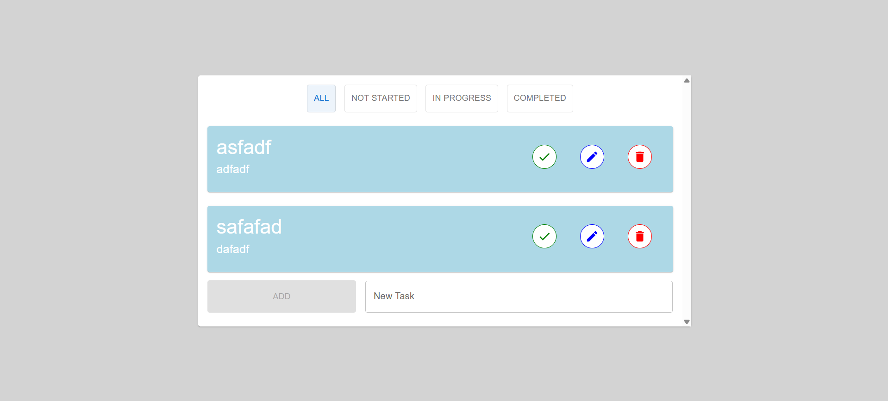
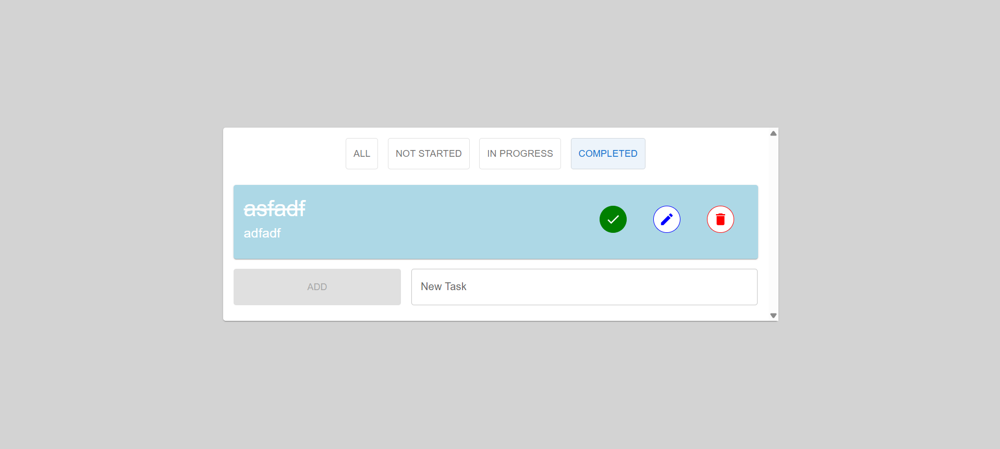
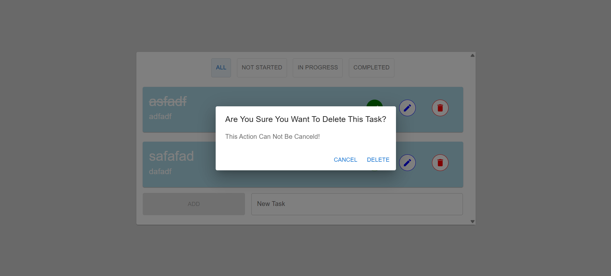
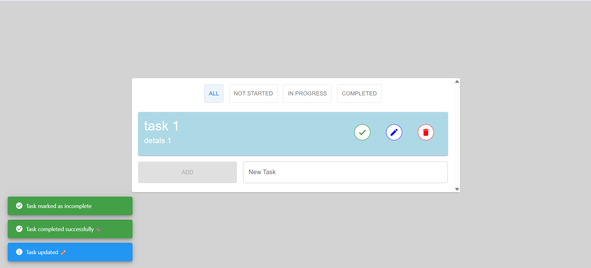

# 📝 Todo List App (React + MUI)

A modern Todo List application built with React, Material UI, and Context API.
The app supports full CRUD operations, task filtering, local storage persistence, and real-time notifications using snackbars.

---

## 🚀 Live Demo
https://react-to-do-list96.netlify.app/

---

## 🚀 Features

✅ Add new tasks

✏️ Update task title and details

❌ Delete tasks with confirmation dialog

🔁 Mark tasks as completed / incomplete

🔍 Filter tasks:

All

Not Started

Completed

💾 Persist data using localStorage

🔔 Snackbar notifications for all actions

🎨 Clean UI using Material UI (MUI)

---

## 🛠️ Technologies Used

- **React**

- **React** Hooks (useState, useEffect, useReducer, useContext, useMemo)

- **Context API**

- **Material UI** (MUI)

- **Notistack** (Snackbar)

- **UUID**

- **localStorage**

---

## 📂 Project Structure

src/
│
├── components/
│   ├── TodoList.js
│   ├── Todo.js
│   └── MySnackBar.js
│
├── contexts/
│   └── TodosContext.js
│
├── reducers/
│   └── todosReducer.js
│
├── App.js
├── App.css
└── index.js

---

## ⚙️ How It Works

**State Management**

- Global state is handled using Context API + useReducer

- All todo actions (add, delete, update, complete) are managed inside todosReducer.js

**Persistence**

- Todos are saved automatically to localStorage

- On app load, todos are restored from storage

**Notifications**

- Snackbars are displayed for:

  - Adding tasks

  - Updating tasks

  - Deleting tasks

  - Completing tasks

---

## ▶️ Getting Started

1️⃣ Clone the Repository
git clone https://github.com/your-username/todo-app.git

2️⃣ Install Dependencies
npm install

3️⃣ Run the App
npm start

**The app will run on:**

http://localhost:3000

---

## 📸 Screenshots

### Todos:

### Completed:

### Delete:

### Update:

### Notifications:

--- 

## 📌 Future Improvements

- Task priority levels

- Due dates & reminders

- Search functionality

- Dark mode

- Backend integration (Firebase / REST API)

--- 

## 👨‍💻 Author

Mahmoud Mekkawy

Frontend / React Developer

💼 WordPress & React Developer

🚀 Building modern web applications

---

## 📄 License

This project is open source and available under the MT License.
